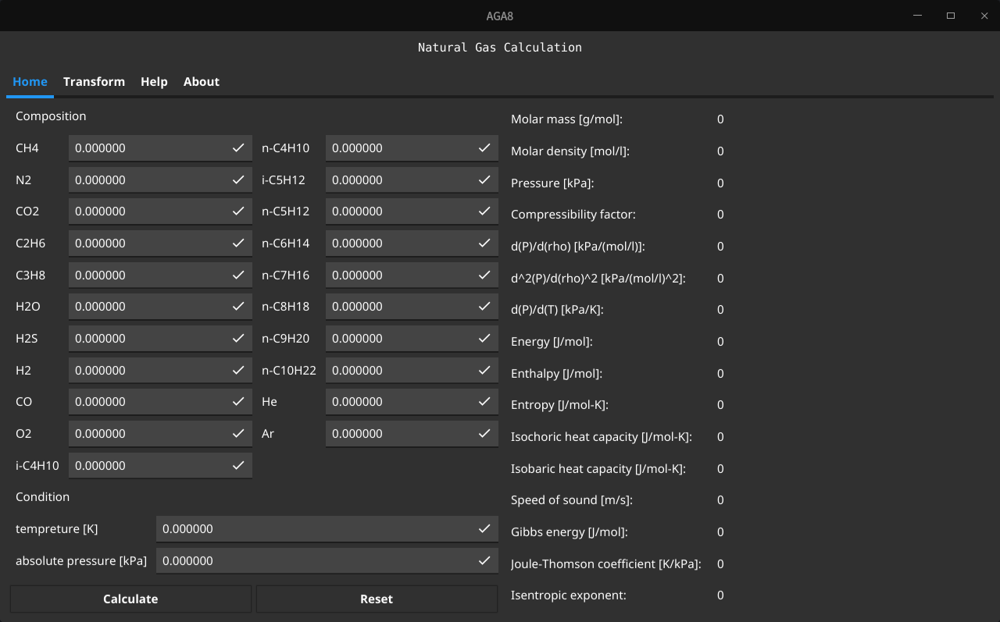

# AGA8

AGA8 is a Golang implementation for the AGA8 standard, complemented with a straightforward graphical user interface (GUI).

## Table of contents

- [AGA8](#aga8)
  - [Table of contents](#table-of-contents)
  - [GUI](#gui)
  - [License](#license)
    - [Algorithm License](#algorithm-license)
    - [Software License](#software-license)
  - [Reference](#reference)

## GUI

The graphical user interface is powered by [fyne](https://github.com/fyne-io/fyne), providing a user-friendly interaction experience.

## License

### Algorithm License

The underlying algorithms in this software were developed by the dedicated employees of the National Institute of Standards and Technology (NIST), a vital agency within the Federal Government. In accordance with title 17 United States Code Section 105, works produced by NIST employees are not subject to copyright protection in the United States. However, it's important to note that this software may be subject to foreign copyright.

Permission is hereby granted, both within the United States and internationally, for the usage, duplication, modification, creation of derivative works, and distribution of this software and its accompanying documentation without the imposition of any fee. This permission is granted on a non-exclusive basis. It's crucial that this notice and disclaimer of warranty appear in all copies.

THE SOFTWARE IS PROVIDED 'AS IS' WITHOUT ANY WARRANTY OF ANY KIND, BE IT EXPRESSED, IMPLIED, OR STATUTORY. THIS INCLUDES, BUT IS NOT LIMITED TO, WARRANTIES OF MERCHANTABILITY, FITNESS FOR A PARTICULAR PURPOSE, AND FREEDOM FROM INFRINGEMENT. ADDITIONALLY, THERE IS NO GUARANTEE THAT THE SOFTWARE WILL CONFORM TO SPECIFICATIONS OR THAT THE DOCUMENTATION WILL BE FREE OF ERRORS. IN NO EVENT SHALL NIST BE LIABLE FOR ANY DAMAGES, INCLUDING, BUT NOT LIMITED TO, DIRECT, INDIRECT, SPECIAL, OR CONSEQUENTIAL DAMAGES ARISING OUT OF THE USE OF THIS SOFTWARE.

### Software License

[LICENSE](./LICENSE)

## Reference

Code Reference: [usnistgov/AGA8](https://github.com/usnistgov/AGA8)
